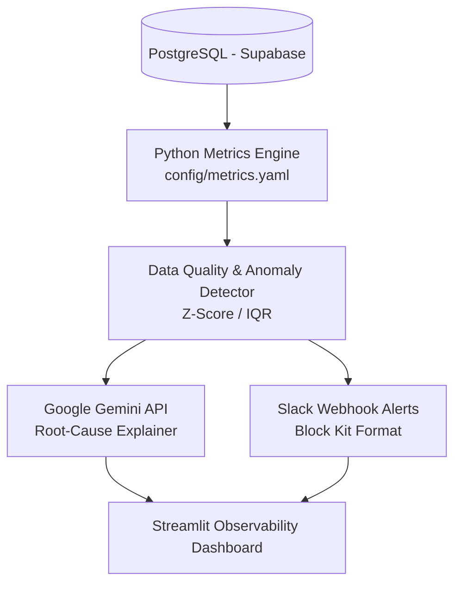

# 📊 AI-Powered KPI & Data Quality Monitoring System

An automated, production-ready data quality and KPI observability platform that monitors business metrics, detects statistical anomalies in time-series data, generates root-cause analyses using generative AI, and dispatches real-time alerts to Slack.

---
## 🏗️ System Architecture

The system operates on an automated schedule powered by **GitHub Actions**, executing end-to-end checks every 30 minutes. Audit trails and run logs are persisted in Supabase.

---

## 🌟 Key Features

* **Semantic Metric Engine:** Centralized YAML configuration (`config/metrics.yaml`) defining business KPIs and validation rules to ensure business logic consistency across systems.
* **Automated Data Quality Suite:** Evaluates database health, record counts, schema integrity, freshness, and null-value bounds on raw event data.
* **Statistical Anomaly Detection:** Leverages time-series baseline algorithms (Z-Score & Interquartile Range) to dynamically flag unusual metric deviations without rigid hardcoded limits.
* **AI Root-Cause Diagnostics:** Integrates the Google Gemini API (`gemini-3.8-flash`) to convert raw anomaly signals into structured, human-readable cause-and-effect explanations.
* **Interactive Alerting:** Sends formatted Slack Block Kit notifications containing direct metric deviations, threshold breaches, and recommended remediation steps.
* **Executive Observability Dashboard:** Built with Streamlit and Plotly to display real-time KPI health, historical trends, anomaly event logs, and operational run metadata.
* **Automated CI/CD Pipeline:** Scheduled 30-minute monitoring jobs and CI integration powered by GitHub Actions.

---

## 🛠️ Tech Stack

* **Database & Storage:** PostgreSQL (Supabase)
* **Core Language & Analysis:** Python 3.11, Pandas, NumPy
* **Generative AI:** Google Gemini API (`google-genai`)
* **Dashboard & Visualization:** Streamlit, Plotly
* **Alerting & APIs:** Slack Incoming Webhooks, REST APIs
* **CI/CD & Automation:** GitHub Actions (Cron schedule & `workflow_dispatch`)
* **Environment & Security:** `python-dotenv`, GitHub Secrets

---

## 🎯 Business Problem

Data teams frequently encounter "silent data outages"—instances where upstream schema updates, failed data pipelines, or unexpected operational shifts degrade metric integrity unnoticed. Standard dashboards display static charts but lack proactive alerting and diagnostic capabilities, leading business stakeholders to identify data issues after bad decisions have already been made.

---

## 💡 Solution

This system creates a continuous feedback loop that monitors metrics at the database level, runs quality checks, detects statistical anomalies automatically, queries an LLM to contextualize the anomaly, and notifies the responsible data engineering team via Slack within minutes of occurrence.

---

## 📈 Operational Results

* **End-to-End Latency:** Reduces time-to-detection for critical KPI anomalies from hours/days to under 1 minute post-pipeline run.
* **Proactive Alerting:** Automatically identifies time-series deviations over configurable standard deviation thresholds ($Z > 2.0$).
* **Automated Run Auditing:** Maintains full audit history across every execution run, stored securely in PostgreSQL tables (`monitoring_runs`, `anomalies`, `data_quality_results`).

---

## ⚠️ Limitations

* **Historical Data Volume:** Anomaly detection accuracy depends on sufficient historical time-series data to establish standard baselines.
* **LLM Context Limits:** Gemini root-cause explanations rely on metadata and available schema context provided in prompt templates; they do not possess external context regarding unlogged infrastructure outages.

---

## 🚀 Future Improvements

* Integrate dbt for upstream data transformations and data lineage modeling.
* Add machine-learning-based time-series forecasting models (e.g., Prophet) for dynamic seasonality adjustment.
* Expand alert channels to include PagerDuty and email integrations.